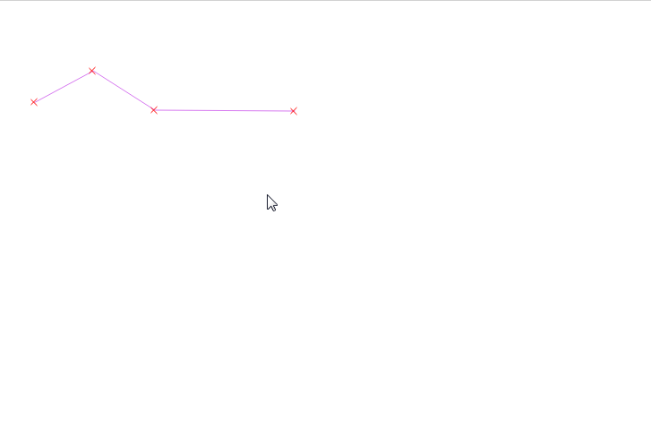
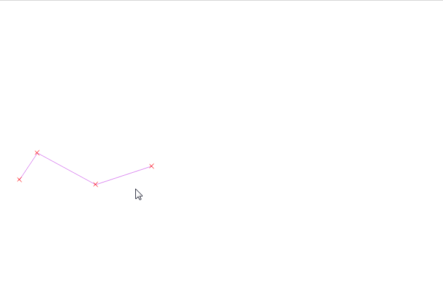
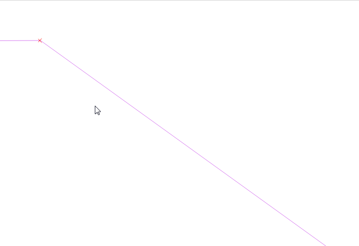
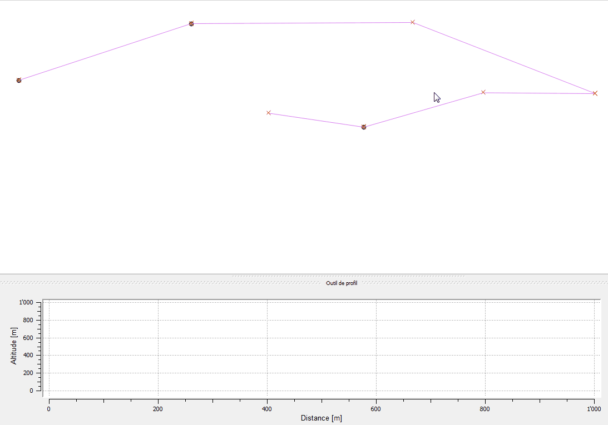
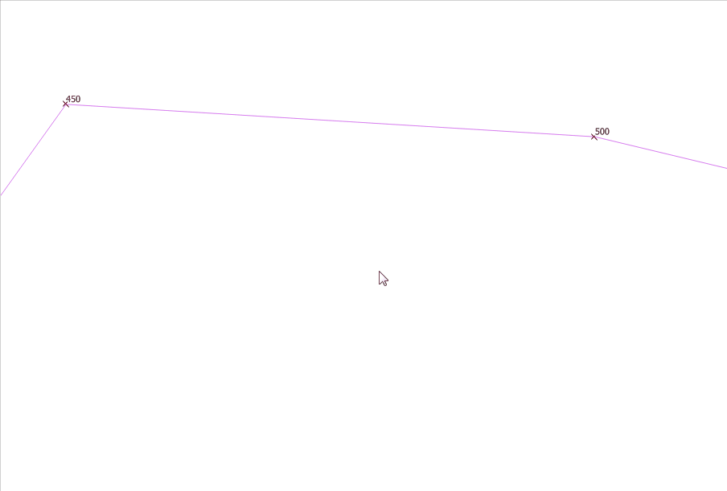
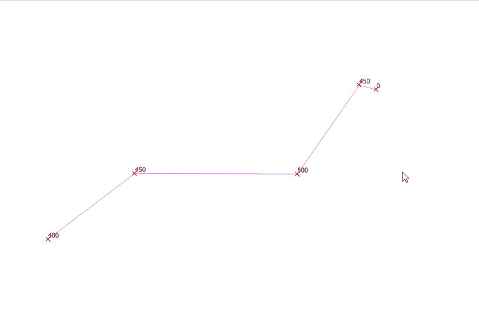

# VDLTools
Outils QGIS pour la Ville de Lausanne
-------------------------------------

- Duplicate

L'outil "Duplicate" permet de copier un objet dans une direction à une distance donnée. La distance est fixe pour chaque noeud de l'objet, donc la géométrie n'est pas conservée.

    - sélectionner une couche éditable
    - sélectionner l'outil
    - sélectionner un élément sur la carte
    - choisir à quelle distance et dans quelle direction dupliquer l'élément.
    - compléter les attributs du formulaire s'il est affiché

---

- Move

L'outil "Move" permet de déplacer ou copier un objet.

    - sélectionner une couche éditable
    - sélectionner l'outil
    - sélectionner un élément sur la carte
    - sélectionner un vertex de l'élément (si ce n'est pas un point)
    - choisir où déplacer/copier l'élément et cliquer (utilisation possible des options d'accrochage de la couche)
    - choisir entre déplacer et copier
    - pour une copie, compléter les attributs du formulaire s'il est affiché

---

- Intersect

L'outil "Intersect" permet de créer un cercle de construction d'un rayon donné. 

    - sélectionner une couche
    - sélectionner l'outil
    - sélectionner une position (utilisation possible des options d'accrochage de la couche)
    - choisir le diamètre
    - en cliquant sur OK le point central est enregistré dans une couche mémoire de points et le cercle dans une couche mémoire de lignes
        ces couches peuvent être choisies dans la fenêtre des paramètres (accessible par le menu Extension->VDLTools)
        si aucune couche n'est séléctionnée, de nouvelles couches sont créées au moment de la création des premiers éléments

---

- Profile

L'outil "Profile" permet d'afficher le profil d'une ligne 3D en parallèle de couches de points 3D.

    - sélectionner une couche lignes
    - sélectionner l'outil
    - sélectionner la librairie d'affichage (2 à choix : "Qwt5" et "Matplotlib", la première par défaut. 
        Comme avantages, "Qwt5" permet de zoomer sur le profil, alors que "Matplotlib" permet de voir où on en est sur la carte en passant 
        la souris sur le profil.)
    - sélectionner une première ligne (celle-ci déterminera le sens du profil) avec le bouton gauche
    - sélectionner autant de lignes contiguës que nécessaire avec le bouton gauche
    - cliquer sur le bouton droit pour lancer le profil
    - choisir les couches de points à afficher
    - si des altitudes ne correspondent pas entre les vertex de la lignes et les points, il est proposer de fair à choix : 
        appliquer l'altitude du vertex au point, appliquer l'altitude du point au vertex, ne rien faire

---

- Interpolate

L'outil "Interpolate" permet d'interpoler une altitude au milieu d'un segment de ligne, et d'y créer un nouveau vertex et/ou un nouveau point.

    - sélectionner une couche points éditable
    - sélectionner l'outil
    - sélectionner la ligne sur laquelle se positionner
    - sélectionner une position (utilisation possible des options d'accrochage de la couche)
    - choisir si l'on veut créer un point, un vertex, ou les deux (si la position contient déjà un vertex : pas de choix, seul le point sera construit)
    - compléter les attributs du formulaire s'il est affiché    

---

- Extrapolate

L'outil "Extrapolate" permet d'extrapoler une altitude en bout de ligne.

    - sélectionner une couche lignes éditable
    - sélectionner l'outil
    - sélectionner une extrémité de ligne à extrapoler (le dernier segment ne doit pas faire plus d'un quart du segment précédent)
 
   

---

- Import

L'outil "Import" permet d'importer des données venant du terrain dans les différentes tables.

    - dans les paramètres, choisir une base de données, un schéma et une table de configuration
    - sélectionner l'outil
    - sélectionner un job non-traité

